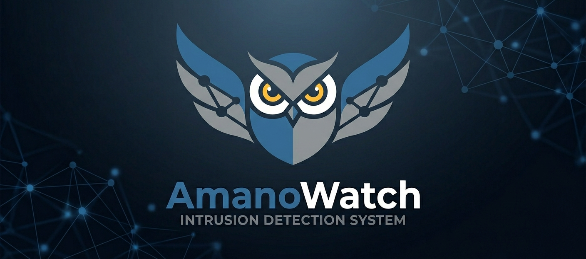

> **⚠️ Important:** AmanoWatch requires elevated privileges. Run as Administrator.

# AmanoWatch 🦉



[](https://opensource.org/licenses/MIT)
[]()

**AmanoWatch** is an open-source Intrusion Detection System built for network enthusiasts, penetration testers, and security professionals. It provides real-time detection of threats including port scans, ARP scans, ICMP ping sweeps, ARP spoofing, DNS tunneling, ICMP tunneling, and honeyport connections — alongside a lightweight interface to filter and view live and historical network traffic.

---

## ✨ Features

- **Real-Time Threat Detection** — Identifies port scans, ARP scans, ICMP sweeps, ARP spoofing, DNS/ICMP tunneling, and honeyport connections as they happen.
- **Traffic Viewer** — Filter and inspect live network traffic by protocol, port, and interface.
- **Multithreaded Architecture** — Separates packet capture, parsing, and detection into dedicated threads for speed and memory efficiency.
- **Persistent Logging** — All detections are stored in a local SQL database for filtering, searching, and review.

---

## 🚀 Getting Started

### Prerequisites

- Python 3.10+
- [Npcap](https://npcap.com/#download)
- [Nmap](https://nmap.org/download#windows)

### Installation

1. **Clone the repository**
```bash
   git clone https://github.com/noahcosamano/AmanoWatch.git
   cd AmanoWatch
```

2. **Install [Npcap](https://npcap.com/#download)** — during installation, check *"Install Npcap in WinPcap API-compatible mode"*.

3. **Install [Nmap](https://nmap.org/download#windows)** — download and run the Windows installer.

4. **Install Python dependencies**
```bash
   pip install -r requirements.txt
```

5. **Run AmanoWatch as Administrator**
```bash
   python main.py
```

---

## 🛠️ Usage

> Documentation in progress. More details coming soon.

---

## 🤝 Contributing

Contributions are welcome and appreciated. To get started:

1. Fork the repository
2. Create a feature branch
```bash
   git checkout -b feature/your-feature-name
```
3. Commit your changes
```bash
   git commit -m "Add your feature description"
```
4. Push to your branch
```bash
   git push origin feature/your-feature-name
```
5. Open a Pull Request

---

## 📄 License

Distributed under the MIT License. See [`LICENSE`](LICENSE) for details.