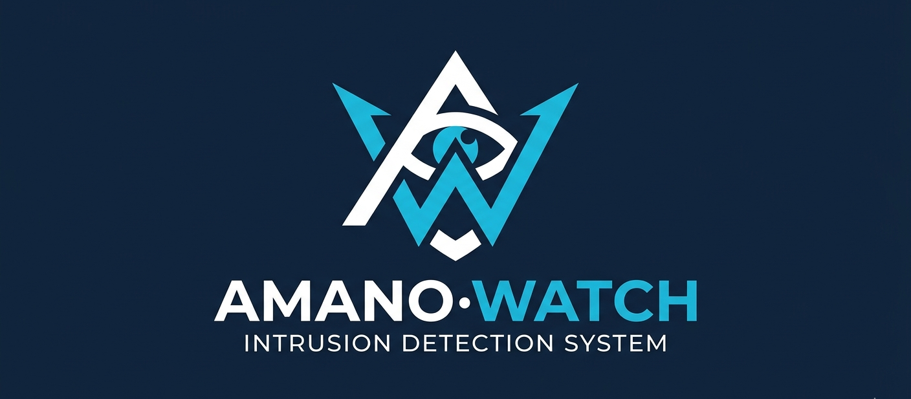

# AmanoWatch 👁️


[](https://opensource.org/licenses/MIT)
[]()

**AmanoWatch** is a simple open-source homemade Intrusion Detection System custom detection for, but not limited to: various port scan types,
ICMP ping sweeps, ARP spoofing, and DNS tunneling. **AmanoWatch** also features a light-weight interface to filter and view network traffic via port/protocol. 
designed for Network Enthusiasts, Penetration Testers, and Security Professionals.

---

## ✨ Features

* **Real-time Monitoring:** Detection for, but not limited to: various port scans, ICMP sweeps, ARP spoofing, and DNS tunneling.
* **Customizable UI:** Allows users to filter and view network traffic by protocol, port, and interface.
* **Lightweight & Fast:** Multithreading creates a lightweight and memory efficient solution by preventing race conditions.
* **Logging:** Seamlessely incorporates a discord webhook in order to log directly to servers/text channels, providing a response solution.

## 🚀 Getting Started

### Prerequisites

Before installing, ensure you have the following:
* Python 3.10+

### Installation

1. **Clone the repository**
   ```bash
   git clone [https://github.com/your-username/AmanoWatch.git](https://github.com/your-username/AmanoWatch.git)

2. **Navigate to the Directory**
   ```bash
   cd AmanoWatch

3. **Install dependencies**
   ```bash
   [Your install command, e.g., npm install or pip install -r requirements.txt]

4. **Run the application**
   ```bash
   [Your start command, e.g., npm start]

##🛠️ Usage
...

##🤝 Contributing
Contributions are what make the open-source community such an amazing place to learn, inspire, and create.

1. Fork the Project

2. Create your Feature Branch (git checkout -b feature/AmazingFeature)

3. Commit your Changes (git commit -m 'Add some AmazingFeature')

4. Push to the Branch (git push origin feature/AmazingFeature)

5. Open a Pull Request

📄 License
Distributed under the MIT License. See LICENSE for more information.
